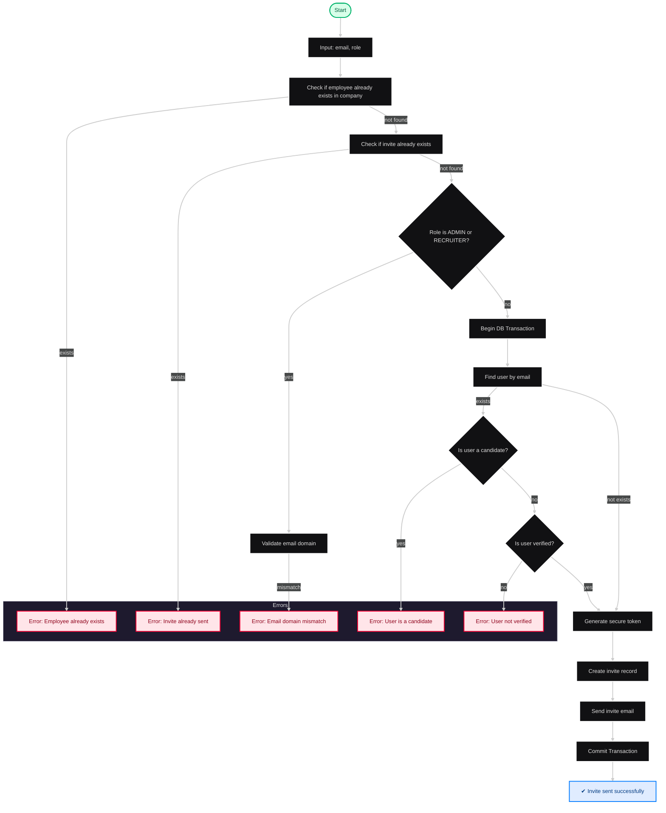

```mermaid
---
config:
  theme: redux-dark
---

flowchart TB
    A(["Start"]) --> B["Input: email, role"]

    B --> C["Check if employee already exists in company"]
    C -- exists --> ERR1["Error: Employee already exists"]

    C -- not found --> D["Check if invite already exists"]
    D -- exists --> ERR2["Error: Invite already sent"]

    D -- not found --> E{"Role is ADMIN or RECRUITER?"}
    E -- yes --> F["Validate email domain"]
    F -- mismatch --> ERR3["Error: Email domain mismatch"]

    E -- no --> G["Begin DB Transaction"]

    G --> H["Find user by email"]
    H -- exists --> I{"Is user a candidate?"}
    I -- yes --> ERR4["Error: User is a candidate"]

    I -- no --> J{"Is user verified?"}
    J -- no --> ERR5["Error: User not verified"]

    H -- not exists --> K["Generate secure token"]
    J -- yes --> K

    K --> L["Create invite record"]
    L --> M["Send invite email"]
    M --> N["Commit Transaction"]
    N --> END["✔ Invite sent successfully"]

    subgraph Errors
      ERR1
      ERR2
      ERR3
      ERR4
      ERR5
    end

    classDef errorNode stroke:#FF0033,stroke-width:2px,fill:#FFE5E9,color:#8E001A;
    classDef startNode stroke:#00B36B,stroke-width:2px,fill:#D7FFE9,color:#035E3F;
    classDef endNode stroke:#007BFF,stroke-width:2px,fill:#E0ECFF,color:#003A80;

    A:::startNode
    END:::endNode
    ERR1:::errorNode
    ERR2:::errorNode
    ERR3:::errorNode
    ERR4:::errorNode
    ERR5:::errorNode
```