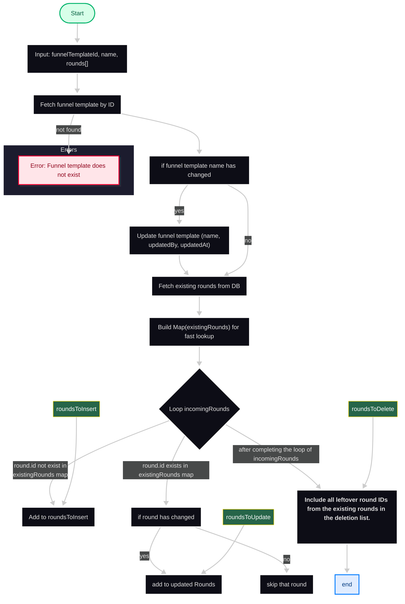

```mermaid
---
config:
  theme: redux-dark
  look: neo
---
flowchart TB
 subgraph Errors["Errors"]
        ERR1["Error: Funnel template does not exist"]
  end
    A(["Start"]) --> B["Input: funnelTemplateId, name, rounds[]"]
    B --> C["Fetch funnel template by ID"]
    C -- not found --> ERR1
    C --> D["if funnel template name has changed"]
    D -- yes --> E["Update funnel template (name, updatedBy, updatedAt)"]
    E --> F["Fetch existing rounds from DB"]
    F --> G["Build Map(existingRounds) for fast lookup"]
    G --> H{"Loop incomingRounds"}
    H -- "round.id not exist in<br><span style=background-color:>existingRounds map    <br></span>" --> I["Add to roundsToInsert"]
    H -- "round.id exists in existingRounds map" --> J["if round has changed"]
    J -- yes --> N["add to updated Rounds"]
    D -- no --> F
    J -- no --> n2["skip that round"]
    H -- after completing the loop of incomingRounds --> n4@{ label: "<p data-start=\"225\" data-end=\"306\"><strong data-start=\"225\" data-end=\"306\">Include all leftover round IDs from the existing rounds in the deletion list.</strong></p>\n<h3 data-start=\"308\" data-end=\"328\"></h3>" }
    n5@{ label: "<span style=\"color:\">roundsToInsert</span>" } --> I
    n6@{ label: "<span style=\"color:\">roundsToUpdate</span>" } --> N
    n7@{ label: "<span style=\"color:\">roundsToDelete</span>" } --> n4
    n4 --> n8["end"]
    n4@{ shape: rect}
    n5@{ shape: text}
    n6@{ shape: text}
    n7@{ shape: text}
     ERR1:::errorNode
     A:::startNode
     n5:::Pine
     n6:::Pine
     n7:::Pine
     n8:::endNode
    classDef errorNode stroke:#FF0033,stroke-width:2px,fill:#FFE5E9,color:#8E001A
    classDef startNode stroke:#00B36B,stroke-width:2px,fill:#D7FFE9,color:#035E3F
    classDef endNode stroke:#007BFF,stroke-width:2px,fill:#E0ECFF,color:#003A80
    classDef Pine stroke-width:1px, stroke-dasharray:none, stroke:#254336, fill:#27654A, color:#FFFFFF
    style n5 color:#FF6D00,stroke:#FFD600
    style n6 color:#FF6D00,stroke:#FFD600
    style n7 color:#FF6D00,stroke:#FFD600
```